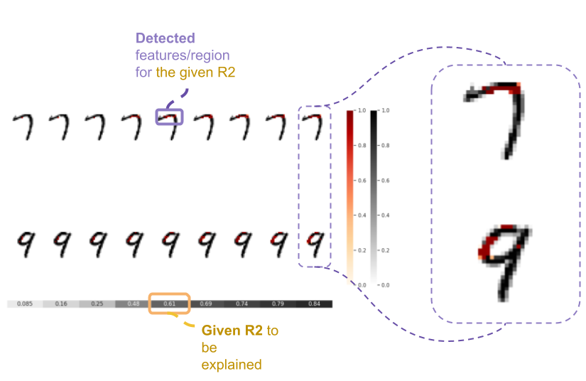
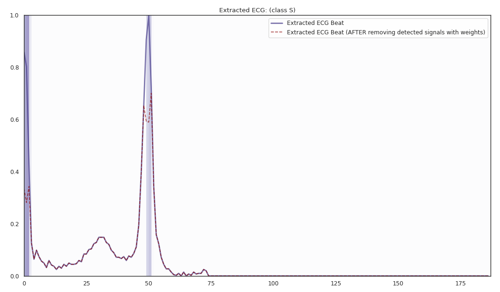
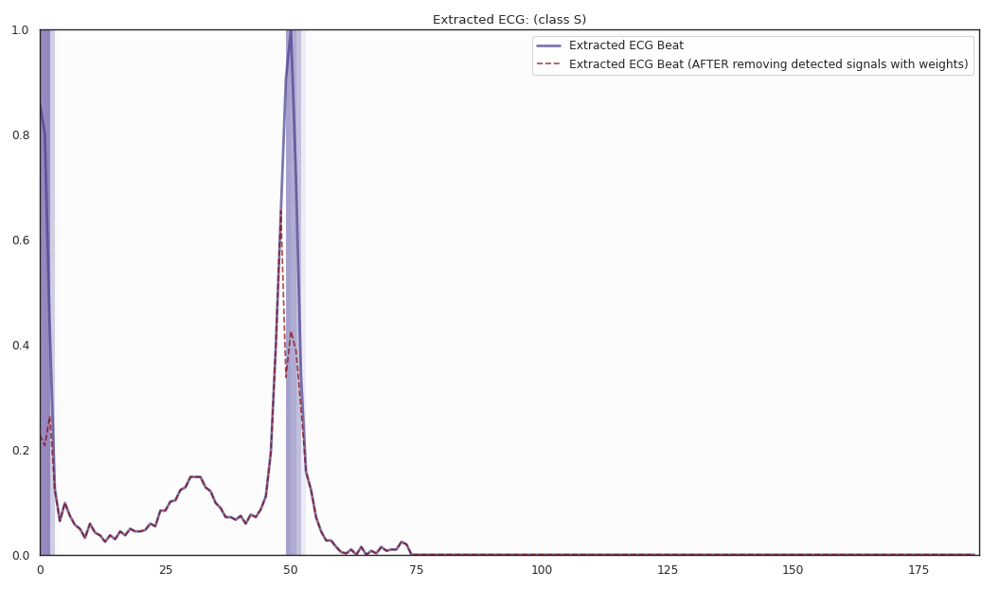
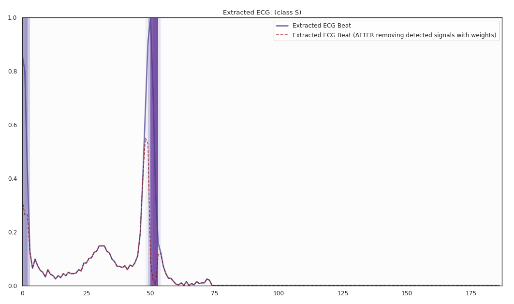
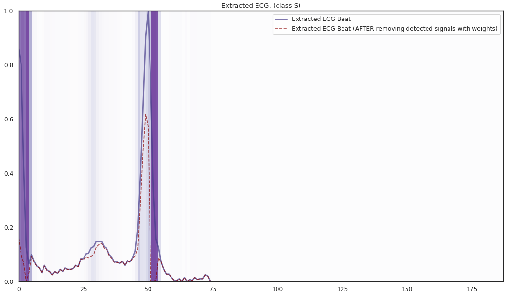
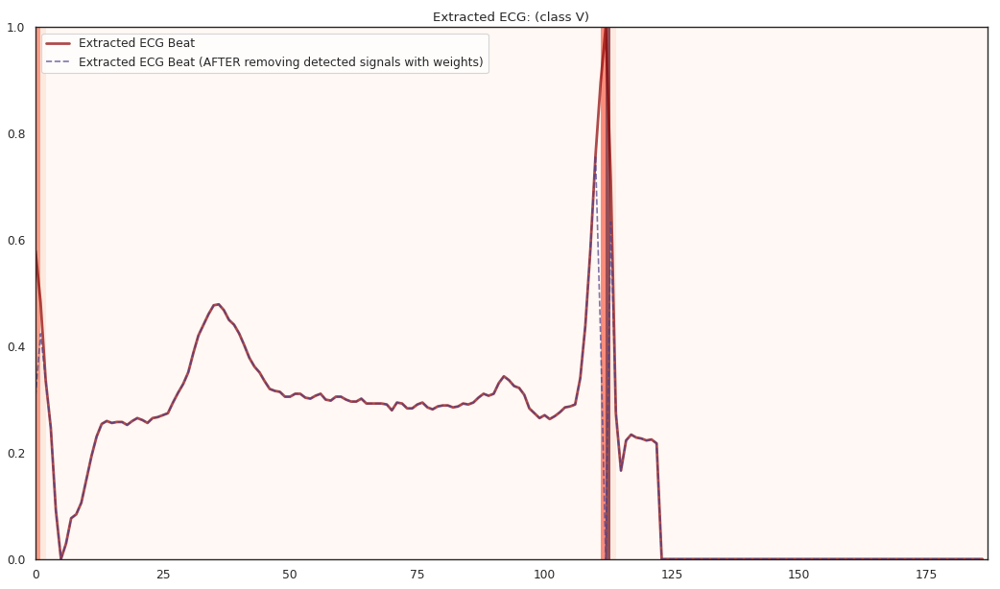
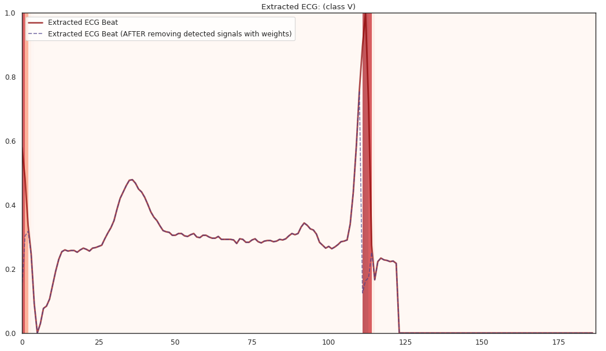
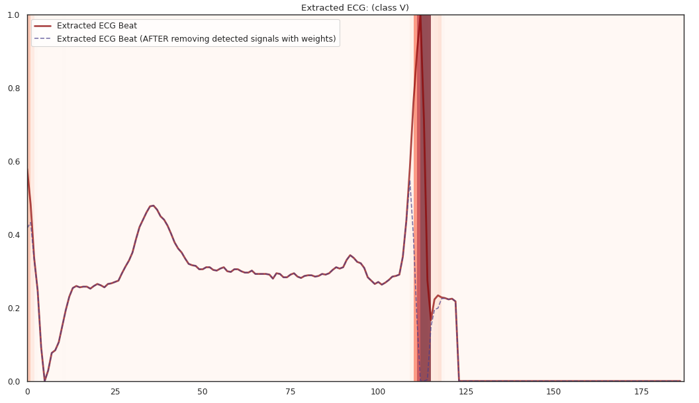
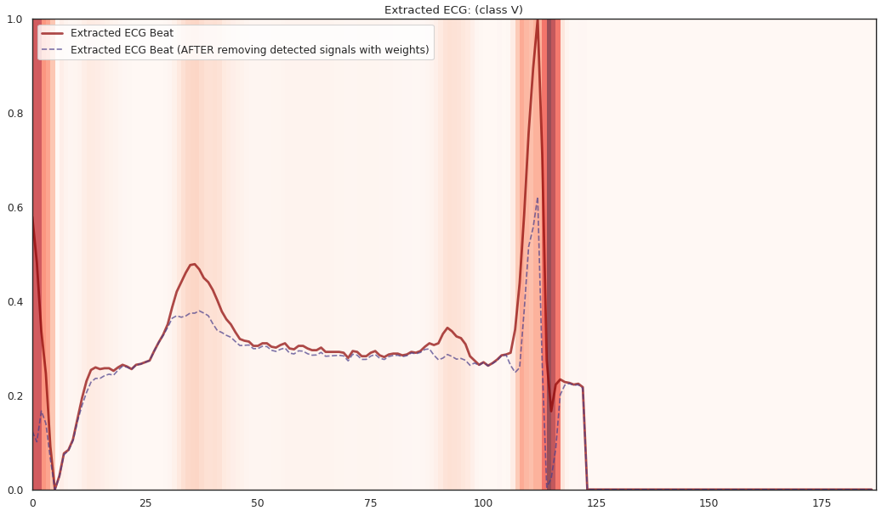

<!-- 
 -->


<!--  -->

# 🎯 **dnn-locate**: Data-adaptive discriminative feature localization with *statistically guaranteed interpretation*

<p float="left">
  
</p>

**dnn-locate** is a Python module for discriminative features localization given a fitted discriminator model, including **neural networks**. **dnn-locate** has the following key features:
1. Adaptive discriminative features. For different instances, **dnn-locate** is able to provide **adaptive** discriminative features.
2. Sparse discriminative features. The discriminative features provided by **dnn-locate** is sparse.
3. Statistically guaranteed interpretation in R-square (R2). **dnn-locate** is able to *effectively* localize the discriminative features with a target R2 of prediction.

<p float="left">
  
</p>


You can find more information for **dnn-locate**:

- GitHub repo: [https://github.com/statmlben/dnn-inference](https://github.com/statmlben/dnn-locate)
- PyPi: [https://pypi.org/project/dnn-locate/](https://pypi.org/project/dnn-locate/)
- Documentation: [https://dnn-locate.readthedocs.io/en/latest/](https://dnn-locate.readthedocs.io/en/latest/)

## **TRUST** (**T**anh **R**el**U** Sof**T**max) activation function 
We achieve the (1)-(3) by using the **Magic** activation: `tanh`+`relu`+`softmax`, namely **TRUST**,

```python
from tensorflow.keras import backend as K

def trust(x, tau, axis_=(1,2)):
  z = tau*K.softmax(x, axis=axis_)
  z = backend.tanh(backend.relu(z))
  return z
```
`trust(x)` satisfies that: (i) `trust(x) <= 1`; (ii) `Σ trust(x) <= tau`, that is, each element if controlled by 1, and the sum of all elements is controlled by `tau`.

## Installation

### Dependencies

`dnn-locate` requires: **Python>=3.8** + [requirements.txt](./requirements.txt)

```bash
pip install -r requirements.txt
```

### User installation

Install `dnn-locate` using ``pip``

```bash
pip install dnn-locate
pip install git+https://github.com/statmlben/dnn-locate.git
```

## Example in **ECG** significant signals localization
- The 'x-axis' is for different R2 explained by the detected features. From left to right, **R2** = [50%, 60%, 70%, 80%].
- The y-axis is for different instances, each row is for a one instance. The corresponding label is included in the title of each subfigure.
<p float="left">
  
  
  
  
  
  
  
  
  
</p>

> *See full ECG localization report* [here](https://wandb.ai/bdai/ECG-DF-detection/reports/ECG-DF-localization--VmlldzoxNDQ5NTgz?accessToken=j53bazfl5c9mi2ztuwzukzgb801b2elb4852jynqu0kry0tjpd6x4vkqahjwh1cq).

### **Conclusion**

- The localized regions of ECG complexes in sinus rhythm are most informative in distinguishing presence of ventricular ectopic beats from supraventricular ectopic beats in a particular individual. The localized regions lie in the **QRS complex**, which correlates with ventricular depolarization or electrical propagation in the ventricles. 
Ion channel aberrations and structural abnormalities in the ventricles can affect electrical conduction in the ventricles, manifesting with subtle anomalies in the QRS complex in sinus rhythm that **may not be discernible by the naked eye but is detectable by the convolutional auto-encoder**. 
Of note, as the $R^2$ increases from 10\% to 88\%, the highlighted color bar is progressively broader, covering a higher proportion of the QRS complex. The foregoing observations are sensible: the regions of interest resided in the QRS complex are biologically plausible and **consistent with cardiac electrophysiological principles**.


- As the R2 increases from 80% to 84% and finally 88%, the blue bar progressively highlights the P wave of ECG complexes in sinus rhythm. This observation is **consistent with our understanding of the mechanistic underpinnings of atrial depolarization**, which correlates with the P wave. Ion channel alterations and structural changes in the atria can affect electrical conduction in the atria manifesting with subtle anomalies in the P wave in sinus rhythm that may not be discernible by the naked eye but are detectable by the convolutional auto-encoder.

- Collectively, the examples underscore the fact that the discriminative regions of interest identified by our proposed method are biologically plausible and consistent with cardiac electrophysiological principles while **locating subtle anomalies in the P wave and QRS complex that may not be discernible by the naked eye**. By inspecting our results with an ECG clinician ([**Dr. Lin Yee Chen**](https://med.umn.edu/bio/cardiovascular/lin-yee)), the localized discriminative features of the ECG are consistent with medical interpretation in ECG diagnosis.

## Notebook

- [nb_ECG](./notebook/nb_ECG.ipynb): Implement in ECG dataset
- [nb_MNIST](./notebook/detect_MNIST.ipynb): Implement in MNIST dataset

## Replication

If you want to replicate the experiments in our papers, please check the [code](https://gocuhk-my.sharepoint.com/:f:/g/personal/bendai_cuhk_edu_hk/EsoQuTiQJ45JoM8hGMz60tABbekz2fM4A7B-W-TAjnU7ew?e=ofZnvb).

## Reference
**If you use this code please 🌟 star the repository and cite the following paper:**
```tex
@article{dai2022locate,
   title={Data-adaptive discriminative feature localization with statistically guaranteed interpretation},
   author={Dai, Ben and Shen, Xiaotong and Chen, Lin Yee and Li, Chunlin and Pan, Wei},
   journal={Annals of Applied Statistics},
   year={2022},
}
```
