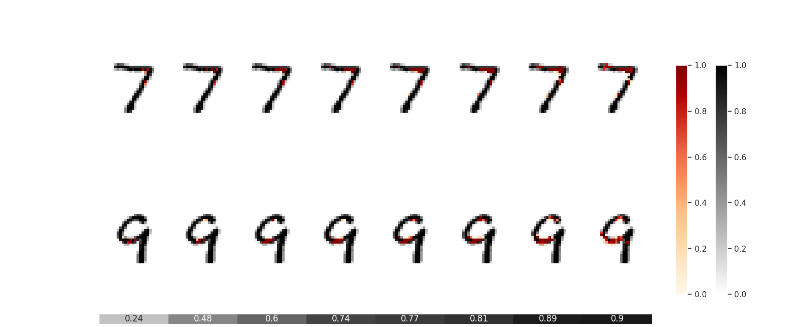

<!-- 
 -->


# dnn-locate


A python library for discriminative features localization based on neural networks.

This project was created by [Ben Dai](http://www.bendai.org) and [Chunlin Li](https://scholar.google.com/citations?user=8dTpVPkAAAAJ&hl=en).



## Installation

### Dependencies

dnn-locate requires:

- Python
- Numpy
- Pandas
- sklearn
- SciPy

### User installation

Install dnn-locate using ``pip``

```bash
pip install dnn-locate
pip install git+https://github.com/statmlben/dnn-locate.git
```
### Source code

You can check the latest sources with the command::

```bash
git clone https://github.com/statmlben/dnn-locate.git
```
## Documentation

## **loc_model**

``` python
class dnn_locate.loc_model(input_shape, discriminator, tau_range, target_r_square, r_square=[], detector=None, combined=None, X_demo=None, X_diff_demo=[], task='classification')
```
``class`` for for discriminative feature detection based on deep learning models.

- Parameters:
	- input_shape : {tuple-like} (shape of the feature/image)
	 For example, in MNIST dataset ``input_shape = (28, 28, 1)``.
	- task: {'classification', 'regression'}, default = 'classification'
	- discriminator: {keras-defined neural network}
	 A pretrained neural network needs to be explained.
	- tau_range : {list-like}
	 List of tau to define the detectors.
	- target_r_square: {float, [0,1]}
	 A target R_square to be explained.
	- R_square: {list-like}
	 Records for R_square values based on a dataset.

#### **loc_model.method**

``` python
def fit(self, X_train, y_train, detector, fit_params, demo_ind=None, X_test=None, y_test=None, optimizer=SGD(lr=.0005))
```

Fitting the detector based on a given dataset.

- Parameters:
	- X_train : {array-like} of shape (n_samples, dim_features)
	 Instances matrix/tensor, where n_samples in the number of samples and dim_features is the dimension of the features.
	- y_train : {array-like} of shape (n_samples,)
	 Output vector/matrix relative to X.
	- X_test : {array-like} of shape (n_samples, dim_features), default = None
	 Instances features to compute the r_square. If ``None``, X_test = X_train
	- y_test : {array-like} of shape (n_samples,), default = None
	 Output to compute the r_square. If ``None``, y_test = y_train
	- detector : {keras-defined neural network}
	 A neural network for detector before Truncated RELU activation.
	- fit_params: {dict of fitting parameters}
	 See keras ``fit``: (https://keras.rstudio.com/reference/fit.html), including ``batch_size``, ``epoch``, ``callbacks``, ``validation_split``, ``validation_data``, and so on.
	- demo_ind : {array-like} default=None
	 The index set for demonstrated instances.
	- optimizer: {keras-defined optimizer: ``tensorflow.keras.optimizers``}, default = 'SGD(lr=.0005)'
	 A optimizer used to train the detector.

``` python
def R_sqaure_path(self)
```
Plot solution path for the proposed method wrt tau_range


``` python
def path_plot(self, threshold=None, plt1_params={'cmap': 'binary'}, plt2_params={'cmap': 'OrRd', 'alpha':0.6})
```
Plots generalized partial R values and its corresponding images wrt tau_range.

- Parameters:
	- threshold : {array-like} or float
	 threshold to truncate the small detected pixels
	- plt1_params : {dict-like}
	 dict for imshow for X_demo
	- plt2_params : {dict-like}
	 dict for imshow for X_diff_demo

``` python
def DA_plot(self, X, y, demo_ind=None, threshold=None)
```
Plots data-adaptive detected region for the fitted detector.

- Parameters
	- X : {array-like} of shape (n_samples, dim_features)
	 Instances matrix/tensor, where n_samples in the number of samples and dim_features is the dimension of the features.
	- y : {array-like} of shape (n_samples,)
	 Output vector/matrix relative to X.
	- demo_ind : {array-like} of shape (num_instance, num_labels) default=None
	- threshold : {array-like} or float, default=None
	 threshold to truncate the small detected pixels

## Example

### Three lines for localization
``` python
tau_range = [4., 6., 8., 10., 12., 14., 16.]
shiing = loc_model(input_shape=input_shape,
				discriminator=discriminator,
				tau_range=tau_range,
				target_r_square=.5,
				task='classification')
shiing.fit(X_train=X_train, y_train=y_train, detector=detector,
			optimizer=SGD(lr=1.), fit_params=fit_params)
```

### Visualize the resuls
``` python
## solution path
shiing.R_sqaure_path()
## samples path
shiing.path_plot()
## data-adaptive demo
shiing.DA_plot(X=X_test, y=y_test)
```

### Full code

``` python
from keras.datasets import mnist
from keras.optimizers import Adam, SGD
from keras.callbacks import EarlyStopping, ReduceLROnPlateau

from dnn_locate import loc_model
import matplotlib.pyplot as plt
import numpy as np
import tensorflow as tf

np.random.seed(3)
tf.random.set_seed(3)

input_shape, labels = (28, 28, 1), 10

## load data
(X_train, y_train), (X_test, y_test) = mnist.load_data()
X_train = X_train / 255.
X_test = X_test / 255.

ind_set = np.array([i for i in range(len(y_train)) if y_train[i] in [7, 9]])
ind_set_test = np.array([i for i in range(len(y_test)) if y_test[i] in [7, 9]])

X_train, y_train = X_train[ind_set], y_train[ind_set]
X_test, y_test = X_test[ind_set_test], y_test[ind_set_test]

X_train = np.expand_dims(X_train, axis=3)
X_test = np.expand_dims(X_test, axis=3)

## define models
from keras import initializers
from keras.models import Sequential, Model
from keras.layers import Input, Dense, Reshape, Flatten, Add, Multiply
from keras.layers import Activation, MaxPooling2D, Conv2D

initializer = initializers.glorot_uniform(seed=0)

## define the detector before TRELU activation
detector = Sequential()
detector.add(Conv2D(32, (2,2),
	padding="same",
	input_shape=input_shape,
	kernel_initializer=initializer,
	bias_initializer=initializer))
detector.add(Flatten())
detector.add(Dense(128, activation='relu',
	kernel_initializer=initializer,
	bias_initializer=initializer))
detector.add(Dense(128, activation='relu',
	kernel_initializer=initializer,
	bias_initializer=initializer))
detector.add(Dense(np.prod(input_shape),
	activation ='softmax',
	kernel_initializer=initializer,
	bias_initializer=initializer))
detector.add(Reshape(input_shape))

## define discriminator
discriminator = Sequential()
discriminator.add(Conv2D(32, (3, 3),
		activation='relu', name='last_conv',
		kernel_initializer=initializer,
		bias_initializer=initializer,
		kernel_regularizer=tf.keras.regularizers.l1(0.001),
		bias_regularizer=tf.keras.regularizers.l1(0.001),
		input_shape=input_shape))
discriminator.add(MaxPooling2D((2, 2)))
discriminator.add(Flatten())
discriminator.add(Dense(100, activation='relu',
	kernel_regularizer=tf.keras.regularizers.l1(0.001),
	bias_regularizer=tf.keras.regularizers.l1(0.001),
	kernel_initializer=initializer))
discriminator.add(Dense(labels, activation='softmax',
	kernel_initializer=initializer,
	kernel_regularizer=tf.keras.regularizers.l1(0.001),
	bias_regularizer=tf.keras.regularizers.l1(0.001),
	bias_initializer=initializer))
discriminator.compile(loss='sparse_categorical_crossentropy',
						optimizer=Adam(lr=0.001),
						metrics=['accuracy'])

## define framework
tau_range = [4., 6., 8., 10., 12., 14., 16.]
shiing = loc_model(input_shape=input_shape,
				discriminator=discriminator,
				tau_range=tau_range,
				task='classification')

es_detect1 = ReduceLROnPlateau(monitor="loss", factor=0.382, min_lr=.0001,
					verbose=1, patience=5, mode="min")
es_detect2 = EarlyStopping(monitor='loss', mode='min', min_delta=.0001,
						verbose=1, patience=15, restore_best_weights=True)
es_learn = EarlyStopping(monitor='val_accuracy', mode='max',
						verbose=1, patience=10, restore_best_weights=True)

print('###'*20)
print('###'*5+' '*6+'Load learner'+' '*5+'###'*5)
print('###'*20)

# learn_tmp = shiing.discriminator.fit(x=X_train, y=y_train,
#									callbacks=[es_learn], epochs=50,
#									batch_size=128, validation_split=.2)

# shiing.discriminator.save_weights("./saved_model/model1107.h5")
# shiing.discriminator.load_weights("./saved_model/model1107.h5")
shiing.discriminator.load_weights("../tests/saved_model/model1119.h5")
# shiing.discriminator.load_weights("./saved_model/model1126.h5")

print('###'*20)
print('#'*16+' '*5+'Train detector'+' '*5+'#'*16)
print('###'*20)

## fit detector for a range of tau
fit_params={'callbacks': [es_detect1, es_detect2],
			'epochs': 1000, 'batch_size': 64}

shiing.fit(X_train=X_train, y_train=y_train, detector=detector,
			optimizer=SGD(lr=1.), fit_params=fit_params)

## Visualize the results
shiing.R_sqaure_path()
shiing.path_plot()
shiing.DA_plot(X=X_test, y=y_test)

```
