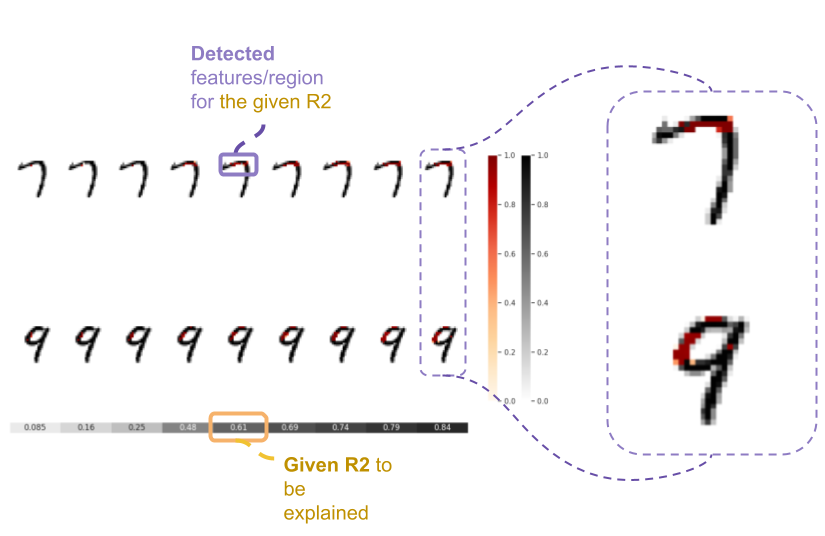

.. dnn-inference documentation master file, created by
   sphinx-quickstart on Sun Aug  8 20:28:09 2021.
   You can adapt this file completely to your liking, but it should at least
   contain the root `toctree` directive.

🎯 **dnn-locate**
=================

.. -*- mode: rst -*-Data-adaptive discriminative feature localization with *statistically guaranteed interpretation*Data-adaptive discriminative feature localization with *statistically guaranteed interpretation*Data-adaptive discriminative feature localization with *statistically guaranteed interpretation*Data-adaptive discriminative feature localization with *statistically guaranteed interpretation*

|PyPi|_ |Keras|_ |MIT|_ |Python3|_ |tensorflow|_ |downloads|_ |downloads_month|_

.. |PyPi| image:: https://badge.fury.io/py/dnn-locate.svg
.. _PyPi: https://pypi.org/project/dnn-locate/

.. |Keras| image:: https://img.shields.io/badge/keras-tf.keras-red.svg
.. _Keras: https://keras.io/

.. |MIT| image:: https://img.shields.io/pypi/l/dnn-locate.svg
.. _MIT: https://opensource.org/licenses/MIT

.. |Python3| image:: https://img.shields.io/badge/python-3-green.svg
.. _Python3: www.python.org

.. |tensorflow| image:: https://img.shields.io/badge/keras-tensorflow-blue.svg
.. _tensorflow: https://www.tensorflow.org/

.. |downloads| image:: https://pepy.tech/badge/dnn-locate
.. _downloads: https://pepy.tech/project/dnn-locate

.. |downloads_month| image:: https://pepy.tech/badge/dnn-locate/month
.. _downloads_month: https://pepy.tech/project/dnn-locate

**dnn-locate** is a Python module for discriminative features localization given a fitted discriminator model, including **neural networks**. **dnn-locate** has the following key features:

1. **Adaptiveness**. For different instances, **dnn-locate** is able to provide **adaptive** discriminative features.
2. **Sparseness**. The discriminative features provided by **dnn-locate** is sparse.
3. *Statistically guaranteed interpretation* in R-square (R2). **dnn-locate** is able to *effectively* localize the discriminative features with a target R2 of prediction.

You can find more information for **dnn-locate**:

- GitHub repo: `https://github.com/statmlben/dnn-inference <https://github.com/statmlben/dnn-inference>`_
- Documentation: `https://dnn-locate.readthedocs.io <https://dnn-locate.readthedocs.io/en/latest/>`_
- PyPi: `https://pypi.org/project/dnn-locate <https://pypi.org/project/dnn-locate>`_
- Open Source: `MIT license <https://opensource.org/licenses/MIT>`_
.. - Paper: `arXiv:2103.04985 <https://arxiv.org/abs/2103.04985>`_

**TRUST** (Tanh RelU SofTmax) activation function 
-------------------------------------------------

We achieve the (1)-(3) by using the **Magic** activation: `tanh` + `relu` + `softmax`

.. code:: python

   from tensorflow.keras import backend as K

   def trust(x, tau, axis_=(1,2)):
      z = tau*K.softmax(x, axis=axis_)
      z = backend.tanh(backend.relu(z))
      return z

`trust(x)` satisfies that: (i) `trust(x) <= 1`; (ii) `Σ trust(x) <= tau`, that is, each element if controlled by 1, and the sum of all elements is controlled by `tau`.

Reference
---------
**If you use this code please star the repository and cite the following paper:**

.. code:: bib

   @article{dai2022locate,
      title={Data-adaptive discriminative feature localization with statistically guaranteed interpretation},
      author={Dai, Ben and Shen, Xiaotong and Chen, Lin Yee and Li, Chunlin and Pan, Wei},
      journal={Annals of Applied Statistics},
      year={2022},
      publisher={Institute of Mathematical Statistics}
   }

📒 Contents
-----------

.. toctree::
   :maxdepth: 2

   installation
   example
   api

Indices and tables
==================

* :ref:`genindex`
* :ref:`search`
   
.. quickstart